# 相机模型

1、相机成像包括的四大坐标系：世界坐标系、相机坐标系、图像坐标系、像素坐标系

    世界坐标系：人为将物理坐标系设置在空间某个位置，张正友将世界坐标系设置在棋盘格平面，Z=0

    相机坐标系：相机坐标系为相机光心位置

    图像坐标系：传感器平面的中心（焦点）

    像素坐标系：相机成像后为了表示像素位置建立的，在左上角起始位置

2、三种变换：刚体变换、透视变换、仿射变换


世界坐标系到相机坐标系的变换称为刚体变换，不发生形变

透视变换：3维向2维的变换

仿射变换：一个图像往另一个图像变换，可能发生形变

相机模型：

像素坐标系（笛卡尔坐标系）：坐标原点在图像左上角，列表示U轴，行表示V轴，单位为像素

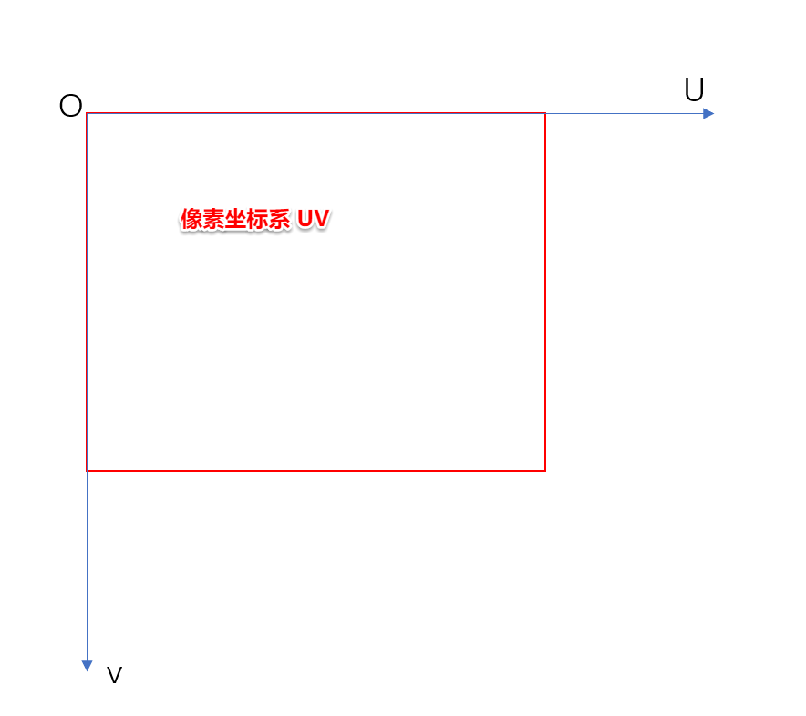

图像坐标系：图像坐标系，坐标原点为主光轴到图像中心投影，单位为mm,如下图XY表示图像坐标系

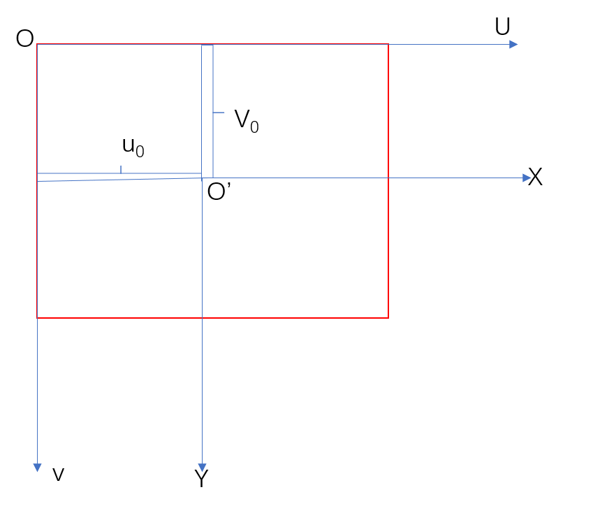

相机坐标系：光心作为相机坐标系的原点0，如下图0\-xyz

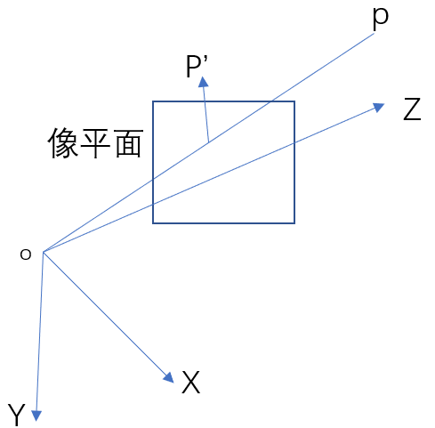

世界坐标系：物理世界指定某个位置为世界坐标系

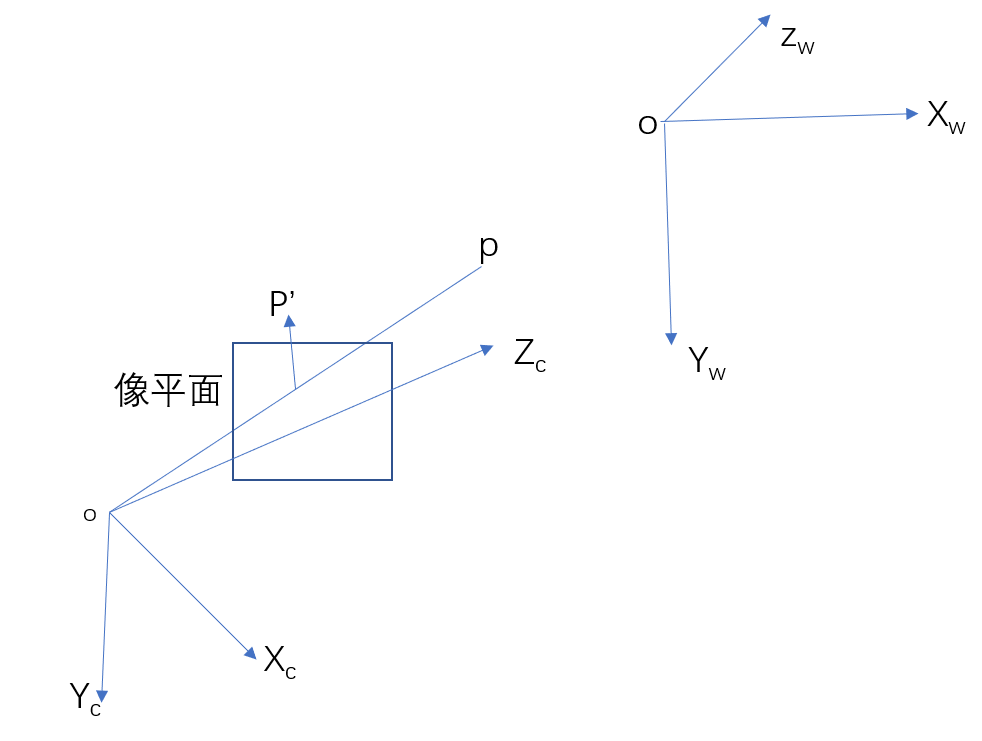

                                                                                                                                                                                                                                                                                                                                                                                                                                                                                                                                                                                                                                                                                                                                                                                                                                                                                                                                                                                                                                                                                                                                                        

坐标系变化：

世界坐标系转化为相机坐标系

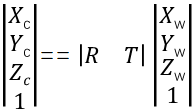

相机坐标系往图像坐标系变化，三维往二维投影

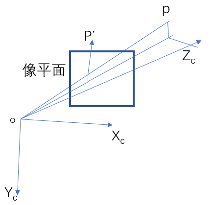

三维点（Xc,Yc,Zc）到二维投影变化成相似三角形，如下公式


将上公式化成下式：

%\!\(EXTRA markdown.ResourceType=, string=, string=\)

%\!\(EXTRA markdown.ResourceType=, string=, string=\)

上式化成矩阵形式表示：

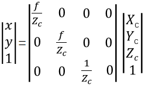

像素坐标系与图像坐标系的单位不同，图像坐标系向像素坐标系变换需要进行尺度变换，才能变成像素单位，假设x方向单位像素为dx ,y方向单位像素dy.

则

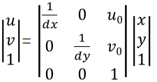

因此可以建立像素坐标uv 与相机坐标系的变化关系，这个变化关系被叫做相机的内参矩阵：

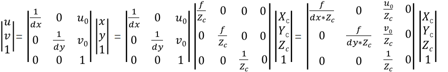

经过变换后公式下

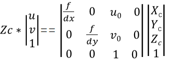

因此相机坐标系与像素坐标系变换关系为，p为像素坐标（u,v） Pc为相机坐标系Pc

%\!\(EXTRA markdown.ResourceType=, string=, string=\)

像素坐标系与世界坐标系变换关系，上式有相机坐标系与世界坐标系的关系。

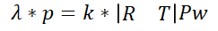

由上面相机模型的相关应用：

一：视差与什么有关：

以相机光心o1为世界坐标系p\(xw,yw,zw\),相机经过立体校正后的模型如下：

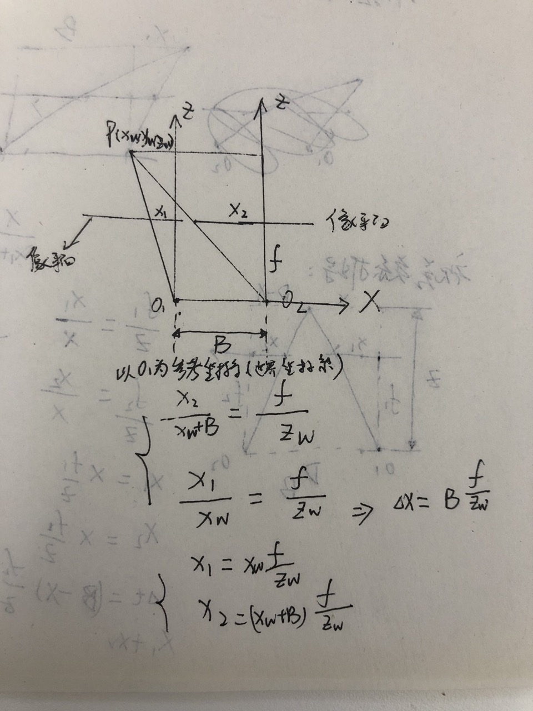

由上面视差推导的结果可知：视差与基线 物距 焦距有关。

二：已知物理世界坐标如何分别投影到图像坐标系的应用:

Pc为左相机坐标系下的三维点，p为像素坐标系。

%\!\(EXTRA markdown.ResourceType=, string=, string=\)

在右相机下的投影


```
clear all;close all;
cam1_k_ = [1885,0,1920;0,1885,1080;0,0,1];
% cam1_k_ = [ 1885.84737, 0.0, 1920;0, 1885.4827, 1080;0.0, 0.0, 1.0];
cam1_d_ = [ -0.36345, 0.2017, 0.0006544,0.000117648,-0.0718];
cam2_k_ = [1885,0,1920;0,1885,1080;0,0,1];
% cam2_k_ = [7367.334/4, 0.0,1920/4;0, 7381.352/4, 1080/4;0.0, 0.0,  1.0];
cam2_d_ = [-0.26045,-0.78665,0.003781,0.004923,10.237];
figure();
hold on;
deg =0:0.02:0.1;
dispairty_sum = [];
dist_IOU = [];
%%%%%%%角度变换对视差的影响
for i = 1:length(deg)
    M = Rot2M('Z',0)*Rot2M('Y',0)*Rot2M('X',deg(i));
    extrin_para  = eye(4,4);
    extrin_para (1:3,1:3)=M ;
    extrin_para(1,4) = 90+deg(i);
    extrin_para(2,4) = 0;
    extrin_para(3,4) = 0;
    extrin_para(4,4) = 1;
    %%%%%%目标为红绿灯
   z = 60000;
   y = 6000;
    x = 2000;
    pt_world1 = [x,y,z];
%%%%%%%lamd*P = k1*Pc
    pixel_1 = cam1_k_*pt_world1';
    pixel_1(1) = pixel_1(1)/pixel_1(3);
    pixel_1(2) = pixel_1(2)/pixel_1(3);
    pixel_1(3) = 1;
%%%%%%%lamd*P = k2*[R,T]Pc
    pt_world2 = [pt_world1,1];
    pt_Rot_2 =extrin_para*pt_world2';
    pt_2 = pt_Rot_2/pt_Rot_2(4);
    pixel_2 =  cam2_k_*(pt_2(1:3));
    pixel_2(1) = (pixel_2(1)/pixel_2(3));
    pixel_2(2) = (pixel_2(2)/pixel_2(3));
    pixel_2(3) = 1;
    dispairty = [pixel_1(1)-pixel_2(1),pixel_1(2)-pixel_2(2)];
    dispairty_sum = [dispairty_sum;deg(i),dispairty];
%%%%%红绿灯大小400
    traffic_imagesize = 400/(z/1885);  
    IOU =  (traffic_imagesize-abs(dispairty(1)))*(traffic_imagesize-abs(dispairty(2)))/((traffic_imagesize+abs(dispairty(1)))*(traffic_imagesize+abs(dispairty(2))));
    distIOU = [deg(i),IOU];
    dist_IOU = [dist_IOU;distIOU];
end   
figure(1)
hold on;
plot(dispairty_sum(:,1),abs(dispairty_sum(:,2)),'*');
plot(dispairty_sum(:,1),abs(dispairty_sum(:,2)));
plot(dispairty_sum(:,1),abs(dispairty_sum(:,3)),'o');
plot(dispairty_sum(:,1),abs(dispairty_sum(:,3)));
legend('x方向产生误差','y方向产生误差')
title('x角度变化影响')
figure(2)
hold on;
plot(dist_IOU(:,1),abs(dist_IOU(:,2)),'*');
plot(dist_IOU(:,1),abs(dist_IOU(:,2)));
for i =1:length(dist_IOU(:,1))
     text(dist_IOU(i,1),dist_IOU(i,2),['(',num2str(dist_IOU(i,1)),',',num2str(dist_IOU(i,2)),')']);
end
%  legend('x????????','y????????')
title('绕x轴角度变化的对红绿灯IOU影响')
```

```
%%%%已知欧拉角度获取外参矩阵
function M = Rot2M(a,B)
    b = deg2rad(B);
    switch a
        case 'X'
            M= [1,0,0;0,cos(b),-sin(b);0,sin(b),cos(b)];
        case 'Y'
           M= [cos(b),0,sin(b);0,1,0;-sin(b),0,cos(b)];
        case 'Z'
            M = [cos(b),-sin(b),0;sin(b),cos(b),0;0,0,1];
    end
```
